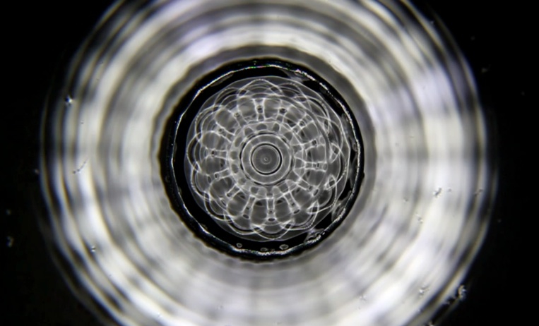

# Major Project Report
## 1. How to interact with the work

**Load the page** : Load the page and the animation starts right away.

**Slider** : Slide the slider to change the smoothness of the wheels.

## 2. individual approach to animation

For my individual project, I chose to focus on Perlin Noise and randomness to create animations.
### Animated Properties of the image and How they are achieved
Compared to the work of other team members, this project emphasizes slow and smooth changes in color and shape, creating an effect where the wheels appear to be rotating. Here are all the animated properties.
#### 1. Color
In this project, I chose to randomly change the colors of the image and ensure that wheels at different positions have different colors. These changes are presented in two forms: one is assigning a color to the wheels that doesn't change over time but refreshes with the page instead of using the original randomColor(). The other is assigning a color to the wheels that changes slowly over time.
#### 2. Shape
The circular outline and inner circle shape of the wheels will change with the variation of Perlin Noise values, creating an effect similar to hand-drawn circles or tree rings. Moreover, the smoothness of the edges can be adjusted by sliding the slider.

#### 3. Pattern in the wheels
The pattern changes along with the variation of the outer edge. One type involves filled dots shifting their centers over time and angle changes, creating a fluctuating effect. The other type involves scaling the entire ring of dots.

#### 4. Size change
The dots on the chain change their size over time and with the variation of Perlin Noise values.

### Inspiration
[__Sonic water:__](http://www.everydaylistening.com/articles/2013/6/22/sonic-water.html)

I was inspired by the wave patterns formed by water under the influence of sound in this project. I decided to use Perlin Noise to create constantly vibrating and changing wheels, resembling the sonic water. The patterns inside the wheels should also shake and change over time.

### Technical Explanation
#### 1. Color Change
##### 1.1 Use Random() to pick colors

I use random values to assign colors to radial lines within the circles. These lines refresh their filled colors frame by frame, creating a rotating effect.

##### 1.2 Use Perlin Noise to assign different colors to circles at different positions
Due to the fact that randomColor() refreshes frame by frame on the page, there's a need to find a function that can assign random colors to wheels and maintain a constant color. Perlin Noise has different values at every pixels on the canvas. Therefore, by using the stored center values in the group, it is easy to assign different RGB values to wheels at different positions.

##### 1.3 Colors change over time
Compute an initial color for each wheel based on its center position. Then, using a combination of Perlin Noise and a time parameter, introduce a gradual change in color over time, starting from the initial color.
#### 2. Shape change
These codes are based on [The Coding Train: Coding Challenge #136.1: Polar Perlin Noise Loops](https://www.youtube.com/watch?v=ZI1dmHv3MeM).
As the angle changes, Perlin Noise provides a continuous range of variation for the radius, creating a wavy edge effect on the canvas. I found that adding the parameter along the z-axis, zoff, can make the edge even smoother because this involves capturing a plane within a 3D graphic.

#### 3. Pattern change
##### 3.1 use Random() to scale the whole pattern ring
##### 3.2 change the position of each dot on the ring
Using Perlin Noise to change the radius from each dot to the center of the wheels and recalculate them as the angle changes. This will alter the center values of each dot, creating an outwardly fluctuating animation effect.

### External Tools
1. [P5.js library](https://p5js.org/zh-Hans/)
2. [The Coding Train Youtube Channal](https://www.youtube.com/watch?v=Qf4dIN99e2w&list=PLRqwX-V7Uu6bgPNQAdxQZpJuJCjeOr7VD)

